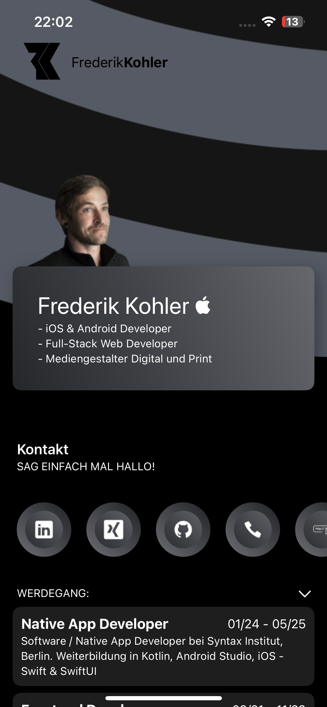

# myCVApp
**myCVApp** ist eine interaktive, digitale Visitenkarte von mir (Frederik Kohler). Sie präsentiert in einer modernen und ansprechenden Benutzeroberfläche alle relevanten Informationen über meine beruflichen Qualifikationen und Erfahrungen. Die App gibt einen Überblick über meine Kompetenzen als iOS & Android Developer, Full-Stack Web Developer, sowie meine Fähigkeiten als Mediengestalter Digital und Print.

Mit klar strukturierten Abschnitten für Kontaktinformationen, beruflichen Werdegang und Qualifikationen stellt die App sicher, dass alle wichtigen Informationen auf einen Blick verfügbar sind. Ich nutze dabei eine moderne Gestaltung, die mein Wissen in UI/UX Design unterstreicht.

Funktionen der CV App:
- Kontaktbereich: Einfaches Erreichen über Social Media Links, Telefon oder E-Mail.
- Beruflicher Werdegang: Detaillierte Darstellung meiner beruflichen Stationen, inklusive meiner Weiterbildungen in Android- und iOS-Entwicklung.
- Tech Stack & Skills: Übersicht über meine technischen Fähigkeiten und Mediengestaltungskenntnisse.
- Ansprechendes Design: Verfügbar in Dark Mode und Light Mode, um die App den Benutzerpräferenzen anzupassen.

Die App dient nicht nur als digitales Portfolio, sondern auch als Inspiration für modernes Design und zeigt meine Fähigkeit, nützliche und ansprechende Anwendungen zu entwickeln.

## App Design

    
    

